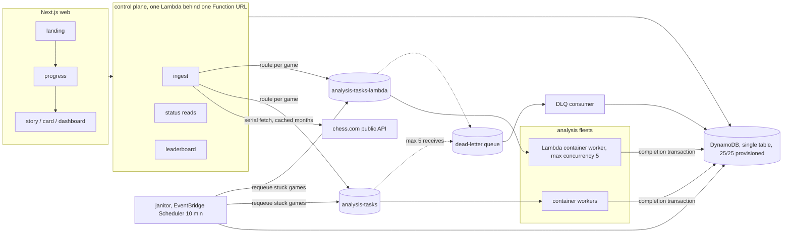

# forked

Distributed chess analysis. Enter a chess.com username, a pool of Stockfish
workers analyzes your entire archive at full, consistent engine depth, and you
get a Wrapped-style story, a shareable card, and archive-level insights no
per-game tool gives: blunder rate by opening, by game phase, by time pressure,
accuracy trends over time, and a computed archetype.

Per-game analysis is a solved, free problem. forked is about the archive:
server-side, fanned out across a worker pool, the same engine depth whether
you open it from a workstation or a phone, incremental re-syncs served from a
content-addressed cache, and the whole thing open source and self-hostable.

## Architecture



One npm-workspaces monorepo: `packages/shared` (pure domain logic, the most
heavily tested code in the repo), `packages/worker` (UCI engine wrapper and
both worker entrypoints), `packages/control` (HTTP API, ingest, janitor, CDK
stack), `packages/web` (Next.js frontend).

## The engineering that matters

**Exactly-once accounting on an at-least-once queue.** SQS delivers at least
once, so every message can arrive twice. Each game completion is ONE DynamoDB
transaction: a conditional flip of the game item from `pending` to its final
state, plus the job counter increment, the result ring, and the running
aggregates. A duplicate delivery fails the condition and the whole
transaction no-ops; counters cannot double-count by construction. The
finalizer works the same way: whichever worker completes the last game wins a
conditional `analyzing -> finalizing` flip, and exactly one finalization
runs. These claims are not asserted, they are exercised: the kill-test
scripts in `scripts/local/` kill workers mid-game, force duplicate
deliveries, purge queues, corrupt counters, and crash the finalizer, then
assert exact convergence.

**A control loop instead of trust.** The janitor (EventBridge Scheduler in
the cloud, an interval locally) does not believe the job counters. Every
sweep it finds overdue jobs through a sparse GSI, recounts from the game
items themselves, repairs drift, requeues stuck games (safe, because
completion is idempotent), re-drives crashed finalizers, and releases
orphaned locks. Whatever breaks, the next sweep converges the system back
toward correct.

**Content-addressed determinism.** An engine record is keyed by
`hash(moves + engineVersion + nodeBudget)` and the engine runs with
`Threads=1`, fixed hash, a fixed node budget, never depth or time limits, so
the same game produces byte-identical analysis on any hardware. Re-syncs are
cache hits that never touch a queue. Engine records structurally cannot leak
between users: the schema has no clock, name, or game-id field, and a test
enforces that at the type level.

**Two fleets, one budget.** Short games route to a Lambda container fleet
(SQS event source, max concurrency 5); long games and everything past a
monthly GB-seconds budget route to plain container workers you can run on any
box. The router reads one budget counter per job; the Lambda handler meters
its own GB-seconds back into it. The whole cloud footprint is sized to the
AWS always-free tier (see `docs/costs.md`; ECR image storage is the one
honest exception, at pennies).

## Scaling benchmark

The identical 100-game job, local stack, one machine (Apple M2: 4 performance
+ 4 efficiency cores), one single-threaded Stockfish process per worker,
150k nodes per position:

| Workers | Walltime | Speedup |
|---|---|---|
| 1 | 29m 57s | 1.00x |
| 2 | 16m 47s | 1.78x |
| 4 | 9m 48s | 3.06x |
| 8 | 11m 31s | 2.60x |

Scaling tracks the physical performance-core count and then honestly
regresses: at 8 workers the single-threaded engines spill onto efficiency
cores and contend, so 4 workers beats 8 on this host. On the intended
deployment shape (Lambda at maxConcurrency 5, one vCPU per worker, plus any
number of container hosts) workers do not share cores, so the fleet scales
with worker count, not with one machine's silicon.

Reproduce with `node scripts/local/benchmark.mjs` (the JVM stack must be up).
Walltime includes ingest and finalization, not just engine time; the cache is
defeated per run so every game is a fresh analysis.

## Privacy model

- Everything analyzed is already public: chess.com archives are public API
  data, and pasted PGNs are analyzed for whoever pasted them.
- A job URL is an unguessable UUID capability: anyone you send the link to
  can see that story. Do not share the link if you do not want that.
- The leaderboard shows public data (username, accuracy, games, archetype)
  and anyone can remove any username from it, no account needed: the data is
  public either way, and removal is the only write the endpoint allows.
- Engine analysis is cached by move sequence, deliberately containing nothing
  about who played the moves. Clock data lives only in per-job game records.
- No accounts, no cookies, no tracking. The only PII stored is what chess.com
  already publishes.

## Security posture

No authentication surface exists (no accounts, no sessions). All write
endpoints are rate limited per IP per day; input is validated at every trust
boundary (username and month regexes, PGN games capped per job and per game
length, header fields length-capped at parse); the web app ships CSP and
frame-denial headers; the table is provisioned, not on-demand, so abuse
throttles instead of billing; workers run as a non-root user and the engine
is a separate pinned-release process, never linked in.

## Development

Requires Node 20+. Docker is optional locally (a JVM stand-in stack is
provided for machines without it).

```
npm ci              # install
npm test            # vitest across all packages (shared, worker, control)
npm run lint
npm run typecheck
npm run synth       # cdk synth of the control stack, Docker-free

# local stack, no Docker:
node scripts/local/jvm-stack.mjs up     # dynamodb-local :8000, elasticmq :9324
npm run api -w packages/control         # control API :8787
node packages/worker/dist/main.js       # a worker (repeat for more)
npm run dev -w packages/web             # web :3000
```

`docker compose up` brings up the same stack containerized. The kill tests
and phase gates live in `scripts/local/` and are all repeatable scripts, not
manual checks.

Self-hosting: see `docs/self-hosting.md`. Cloud deploy runbook:
`docs/deploy.md`. Cost budget: `docs/costs.md`. Engine pinning policy:
`docs/engine-versioning.md`.

## License

This repository's code is MIT licensed. The Stockfish chess engine is GPLv3,
developed by the Stockfish community, and runs strictly as a separate
process; it is never linked into this code and never vendored into this
repository. The worker images download the pinned official release at build
time and carry attribution. See `docs/NOTICE` and
https://github.com/official-stockfish/Stockfish.
